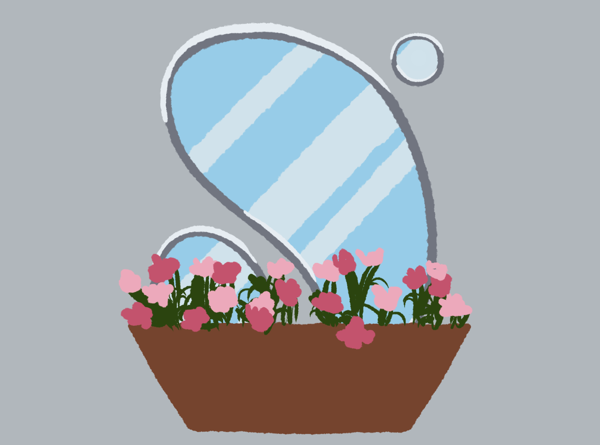
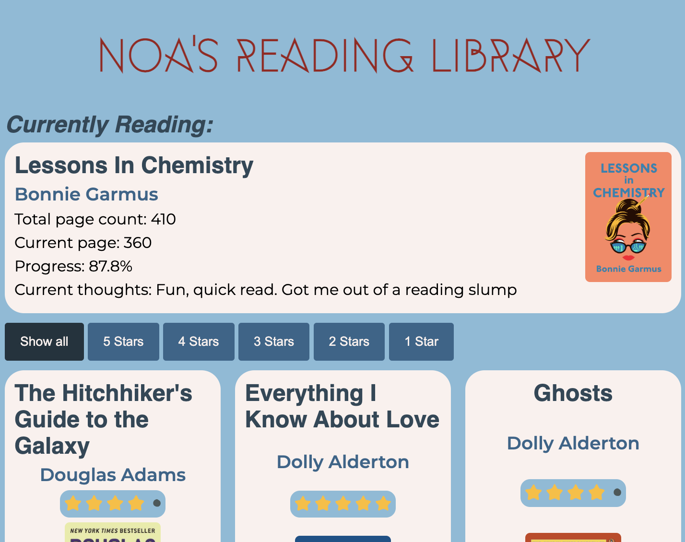
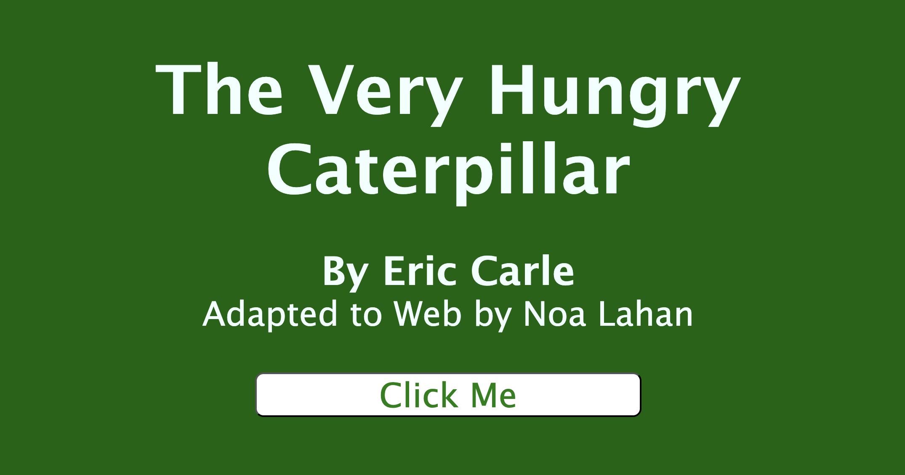

# Weeklies

Small websites done as weekly excersices.

## Doormat

**Prompt:** Use [anideafora.website/](https://web.archive.org/web/20240423075802/https://anideafora.website/) (no longer online, see content [here](https://www.are.na/ian-mcdonald/an-idea-for-a-website)) to autogenerate your website prompt.

Generated Prompt: A website with a key under the doormat.

## Flowers

**Prompt:** A customizable website.

A virtual flower windowsill.

## Books

**Prompt:** A website using a remote API, "your own corner of the internet".

My virtual book library. I try to keep this regularly updated. A link to the google sheets the website uses to get the data from is attached at the bottom.

## Caterpillar

**Prompt:** A website that tells a story.

A digital way to read the very hungry caterpillar.

## Snow Globe

**Prompt:** Create a website using NodeJS with Vite and animejs.

A virtual snow globe.

https://empty-ray.surge.sh/
